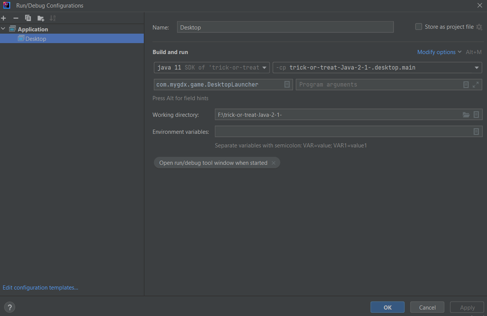
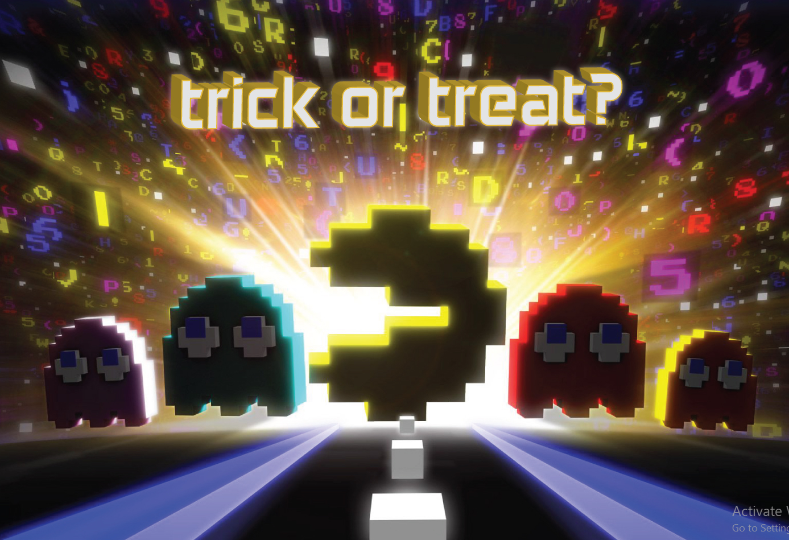
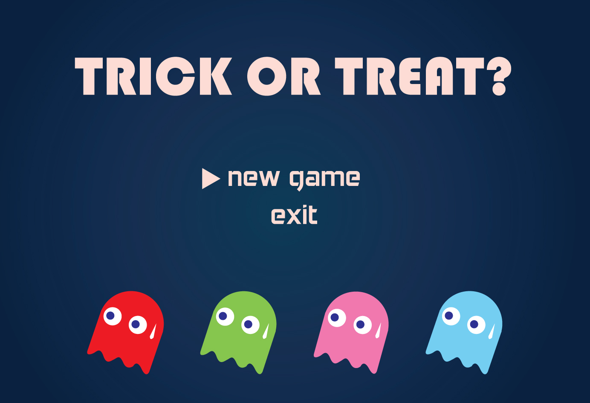
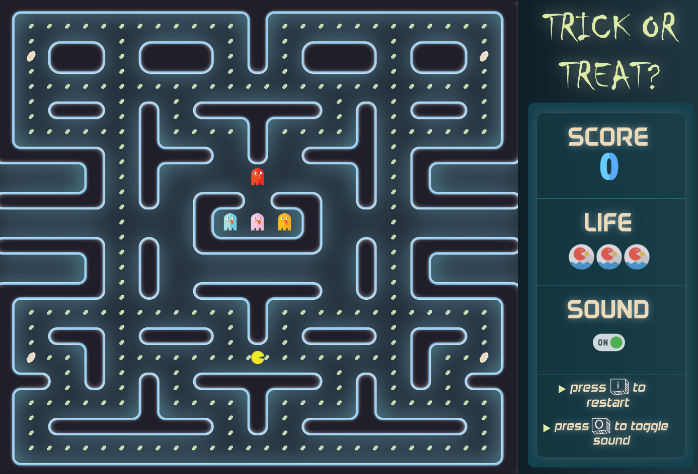
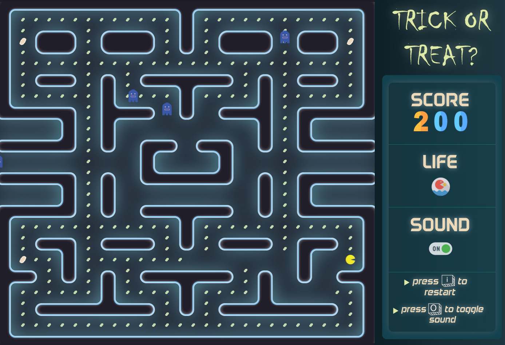
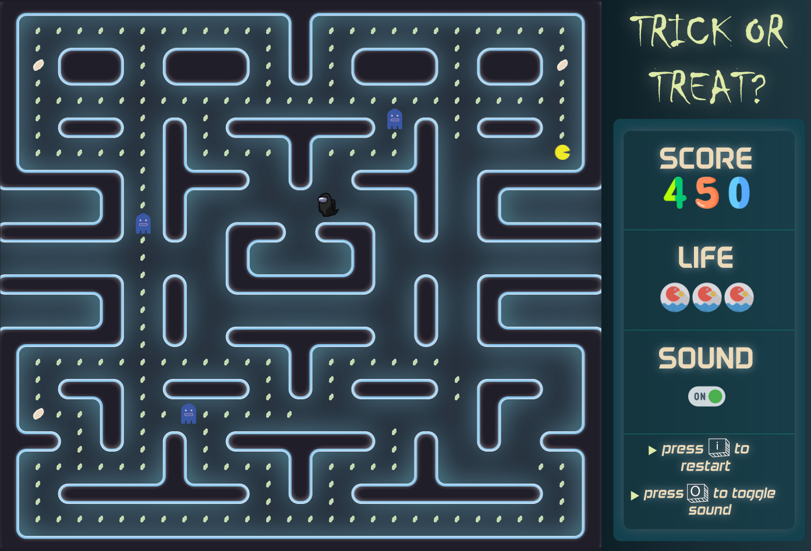
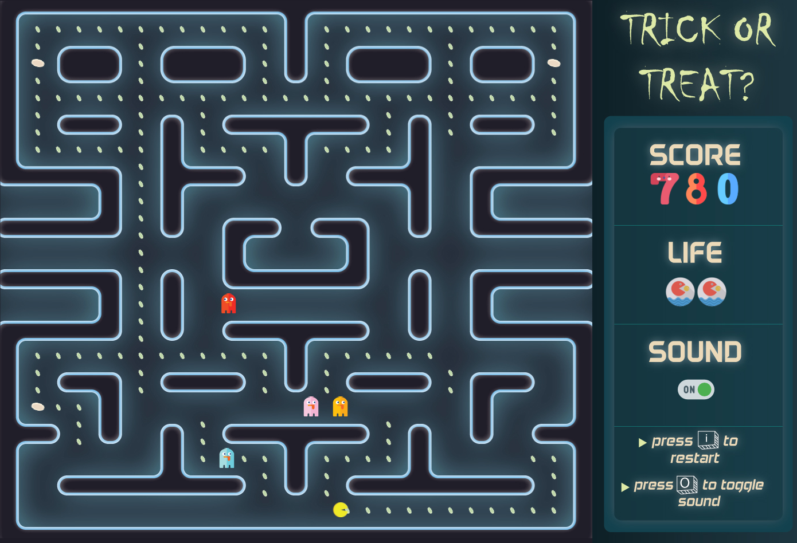
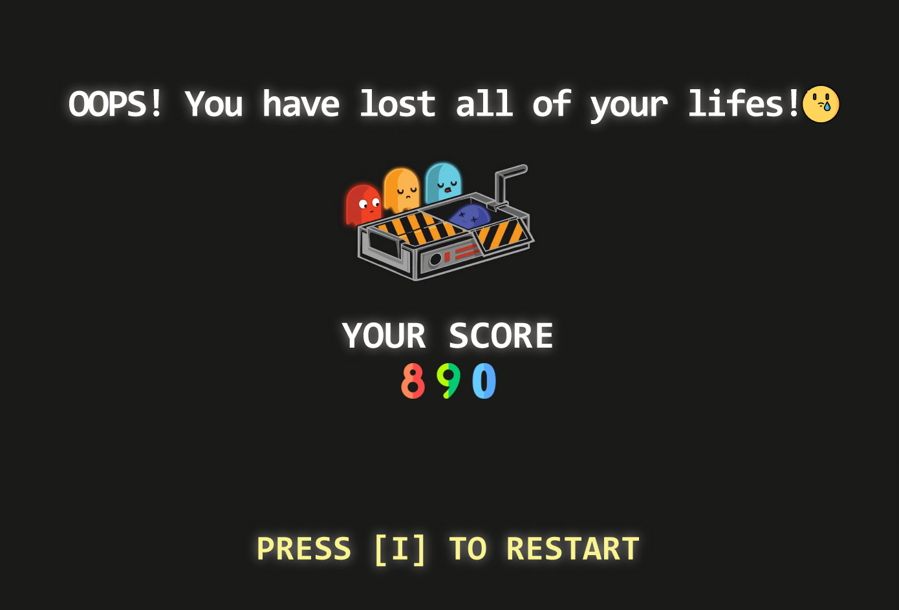

# Pacman Laptop Version Game

Welcome to the Pacman Laptop Version Game! This project is developed in Java and is hosted on GitHub. This README file provides detailed instructions on how to clone, set up, and run the game locally using IntelliJ IDEA.

## Table of Contents

- [Prerequisites](#prerequisites)
- [Cloning the Repository](#cloning-the-repository)
- [Setting Up Locally](#setting-up-locally)
- [Running the Game](#running-the-game)


## Prerequisites

Before you begin, ensure you have the following installed on your machine:

- [Java Development Kit (JDK) 8 or higher](https://www.oracle.com/java/technologies/javase-jdk11-downloads.html)
- [IntelliJ IDEA](https://www.jetbrains.com/idea/download/)
- [Git](https://git-scm.com/downloads)

## Cloning the Repository

To get a copy of the project up and running on your local machine, follow these steps:

1. Open your terminal or command prompt.
2. Navigate to the directory where you want to clone the repository.
3. Run the following command to clone the repository:

    ```sh
    git clone https://github.com/Rifat-Shariar-Sakil-24/trick-or-treat-Java-2-1-.git
    ```

4. Navigate to the project directory:

    ```sh
    cd trick-or-treat-Java-2-1-
    ```

## Setting Up Locally

Once you have cloned the repository, you need to set it up locally in IntelliJ IDEA:

1. Open IntelliJ IDEA.
2. Click on `File` -> `Open...`.
3. Navigate to the cloned project directory and select it.
4. Choose build.gradle from gradle folder 
Once the project is imported, let IntelliJ IDEA download any necessary dependencies.

## Running the Game

To run the game, follow these steps:

1. In IntelliJ IDEA, open the `core` folder then `src` then `TheLastLife` Class.
2. Now Add Configuration.
3. Write Desktop in `Unnamed` Section as Application in new Configuration.
4. In Build And Run Choose everything like below:
   
5. Choose Apply and Click Ok
6. Click `Run Desktop` from above beside Desktop Configuration
7. The game should start, and you can play Pacman on your laptop.

## Some Game Play Shots





### Starting Screen


###  Frightened Mode




### Player ate a monster at Frightened Mode




### Monsters chasing player


### All lives lost of the player

